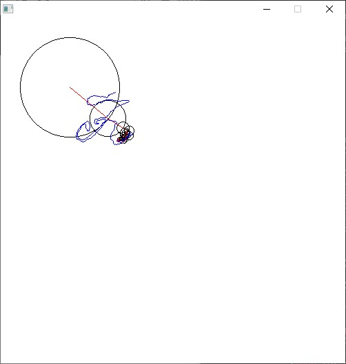

# epicycles
### _Bibek Panthi <bpanthi977@gmail.com>_

Draw like [3Blue1Brown](https://www.youtube.com/watch?v=-qgreAUpPwM) . 

## Example: 



## How to run
* Clone the repo 
* ```common-lisp 
(ql:quickload :epicycles)
(epicycles::main "path/to/you/image.png")
```
* Done! :) 

## License 
GNU GPL v2 

